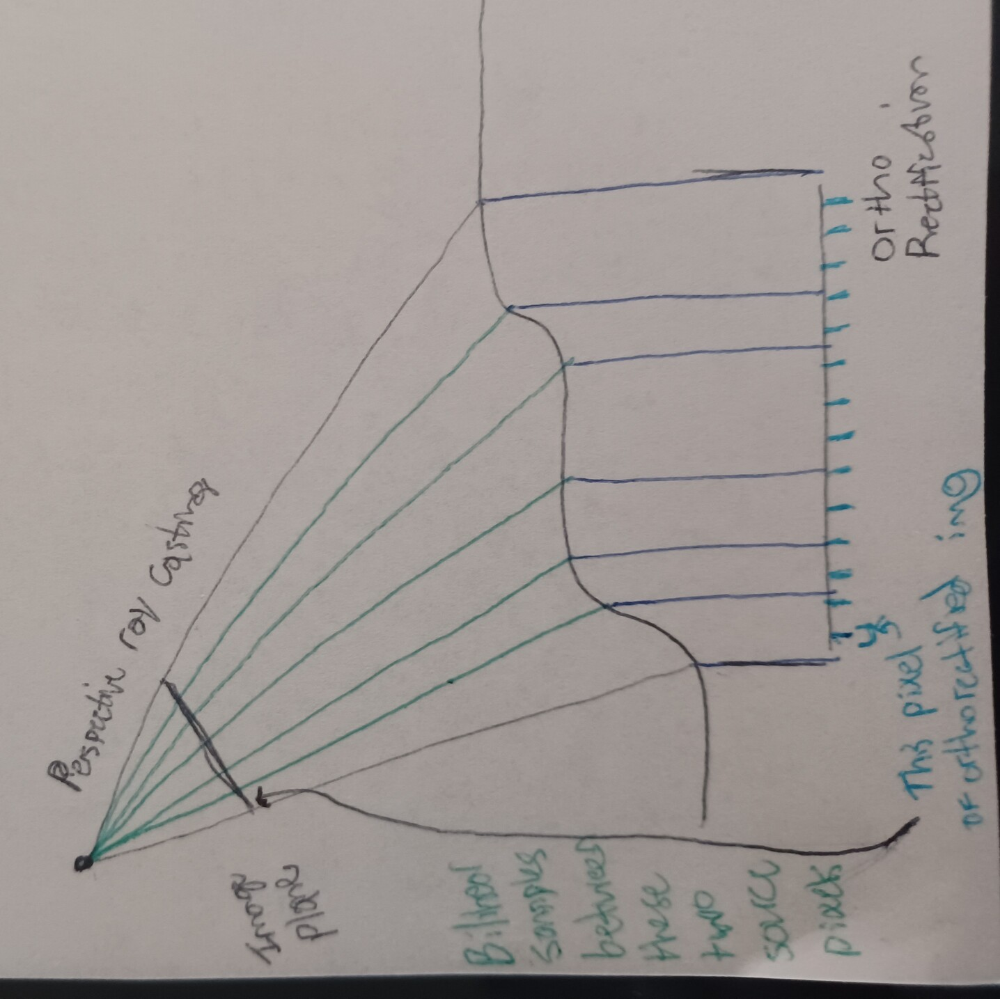

# Ortho Rectifcation

Given poses, camera intrinsics, and images acquired by some downward-looking camera on an aircraft, form an orthorectified, mosaiced GeoTIFF.

This project supports making the orthoimage with the recorded raw pose data. The intent is also to support a bundle adjustment step.

Any methods of estimating initial poses (e.g. GPS + acc + magnetometer) have biases, time delays, and other sources of error that make orthoimages derived from them inaccurate and inconsistent. The bundle adjustment step should be able to greatly help.

## sortho
### Loading

`FrameWithPosePrior`s are loaded by a generator. They must have an `HWC` image, camera intrinsics, sensor orientation, and a pose prior (e.g. GPS Pos + platform orientation)

### Geometry

#### DtedRayMarcher

I implemented a terrain intersection method inspired from the "ray marching" technique from computer graphics.

How can you project rays from an optical center, through the image plane, and onto a DTED terrain map?
The best answer seems to be to use a tiled OpenGL renderer and look at the resulting depth map. That's complicated and may need a lot of disk loads to load the proper level-of-detail according to the current pose and camera.

Another way would be to sample the terrain under the camera and do one ray plane intersection. This would work flawlessly if the terrain elevation under the camera were the same as *where the camera is pointed* (always perfectly if the camera is exactly nadir).

The way I implemented was similar to this but inspired by ray marching with signed distance functions. Do not move along the ray according to the ray-plane intersection `(1 / R.zz) * (alt-elev)`, but instead by just the perpindicular `(alt-elev)` value. Do this multiple times, updating `elev` by resampling the terrain under the current points at each iteration. `alt-elev` is not a proper SDF value, but it's usually close.

This is useful to render a 2d image w/ 3d perspective from an already orthorectified image, as well as to find the extent of the pixels of a projected frame (in e.g. WM coordinates)

#### Orthorectifier

The green lines are **cast from the camera to the terrain** to find the extent of the projected pixels.

The __blue tick marks__ represent pixels of the orthorectified image. After sampling terrain values for the the grid of blue ticks, and converting to ECEF, they are projected onto the image plane. This gives a map __from__ pixels of the frame __to__ output orthorectified pixels.

### Blending

[Good resource](https://web.stanford.edu/class/cs231m/lectures/lecture-5-stitching-blending.pdf)

There's four kinds of blending I'd like to implement, in increasing order of complexity:
1. Feathering
1. Laplacian Pyramid
1. Two-band
1. Poisson

The latter two would probably improve upon the Laplacian Pyramid technique that is implemented now. I implemented the Laplacian Pyramid technique as suggested by [frame 66 of this presentation](https://web.stanford.edu/class/cs231m/lectures/lecture-5-stitching-blending.pdf).

### Bundle Adjustment

> Not implemented yet.

Frames have keypoints chosen and matched to those of nearby frames. This is used, in combination with elevations under __current keypoint values__ and with priors on the poses, to form a graph optimization problem.

The matching can be done with traditional keypoint detectors+descriptors, focused FFT regions (since scale and approximate orientation known pretty well), or detector-free CNN approaches (like LoFTR).

I will use gtsam for the graph optimization.

#### Keypoint Matching
Assume a temporal structure to the sequence of images -- meaning we needn't do any global image matching to discover related frames.

Try a few things:
1. FFT on windows at fixed foci in each image
2. SIFT/ORB
3. LoFTR

